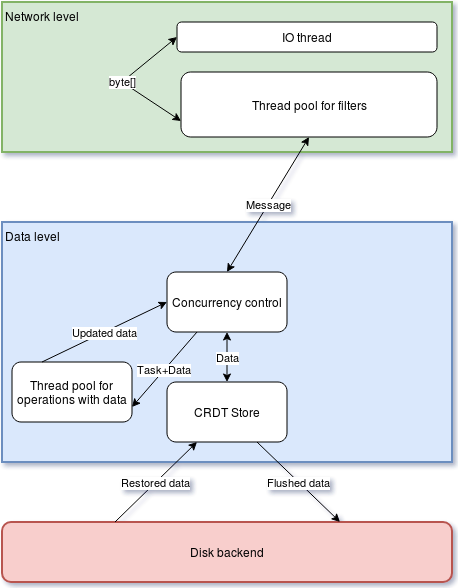

# Modor

## About

Modor (**M**y **o**wn **d**atabase **o**n **R**ust) is distributed [CRDT](https://en.wikipedia.org/wiki/Conflict-free_replicated_data_type) storage. It's [AP](https://en.wikipedia.org/wiki/CAP_theorem) system without heavy computing operations (like transactions or map-reduce).

## Architecture [in development]

On the top level Modor architecture looks like that:

### Data level
The central level is `Data level` which allow to store and transform data in CRDT structures. It's decomposed into three parts:
- Concurrency control mechanism which helps to make parallel calculation with data.
- The thread pool which makes this calculation.
- CRDT store which contains the data.

Concurrency control mechanism takes messages from `Network level` convert it to tasks make thread-safe access to data and send it to thread pool on execution.

### Network level
The `Network level` allows sending and receiving messages. It also filters and transforms messages (encryption, compression, etc).

## Development principles

### Task management

1. No one can push into master branch directly. All changes should come from PR.
2. No one can't create PR without issue.
3. In case if your PR accidentally found bugs in old feature and can't work without fixing then your PR will be frozen until a bug in the old feature would not be fixed.

### Code style and documentation

1. Priorities in order from hi to low:
   1. **Maintainability**. Because code which can't be modified is dead.
   2. **Accuracy**. Because code which works incorrectly exist only for modification.
   3. **Performance**. Because is not the most important thing in life.
   4. **Features**. Because we are not a startup.
2. `Unsafe` is prohibited.
3. The best way for use concurrency is avoiding it. Use channels.
4. Code as documentation is self-delusion. Something which looks clear to me will be strange and ugly for someone else. Any algorithms should have comments. Any not trivial decision which you make should have comments. It isn't freeing from making the code as clear as possible.
5. Should exist document which describes system on the high level. Because otherwise, the architecture will collapse.
6. It's okay to write about functionality which development still in progress.

### Testing

1. No one can merge PR with untested features.
2. All deterministic functions (without concurrency and IO) should have 100% test coverage.
3. Master branch should be totally green.
4. Try to avoid design which entails using mock objects in tests.
5. Floating test is also red test.
6. For bug report should exist reproducer. But if some bug rarely appears in the async code, then it's enough to have a math proof of incorrectness. But the best solution extract async part for separated unit tests.

### Releasing

1. Version pattern is `x.y.z`.
2. The first release is `0.1.0`. It also means first runnable prototype.
3. An increment of `x` means broken backward compatibility.
4. All versions with the same `x` except `x == 0` have backward compatibility.
5. `z` is incremented when one month passed and 10 commits accumulated after the last release.
6. At any time there is one active roadmap which decomposes a huge improvement to tasks, which can be decomposed too if necessary.
7. `y` is incremented when a task from roadmap completed.
